# Store Inventory & Order Management System

A Django app for managing products, customers, and orders, built to actually understand how inventory and order tracking works under the hood, not just to look good on a resume.

## Overview

I built this to get hands-on with Django's backend side: models, relationships between them, forms, and templates. It mimics what a small store or warehouse might need internally, add products, register customers, place orders, and track where each order is in its lifecycle.

It's not deployed anywhere. I ran it locally the whole time because the point was learning Django properly, not shipping something for real users.

## Features

- **Products** : add and categorize items with images and tags, so they're easy to filter later
- **Customers** : every customer record is tied to their order history
- **Order tracking** : orders move through `Pending → Out for Delivery → Delivered`
- **Dashboard** : shows order counts by status at a glance, instead of scrolling through a list
- **Data relationships** : products, customers, and orders are connected through Django's ORM (foreign keys, related managers)
- **Form validation** : server-side checks on product, customer, and order forms
- **Template inheritance** : shared layout across pages instead of repeating HTML everywhere

## Tech Stack

- **Backend:** Python, Django
- **Database:** SQLite
- **Frontend:** Django Templates, HTML, CSS

## How It Works

1. Add products with a name, price, stock count, image, and tags.
2. Register customers, each one gets linked to whatever they order.
3. Place an order against a customer and their products. It starts as `Pending` and moves to `Out for Delivery`, then `Delivered`.
4. The dashboard pulls all that together and shows order counts by status.

## Screenshots

### Login
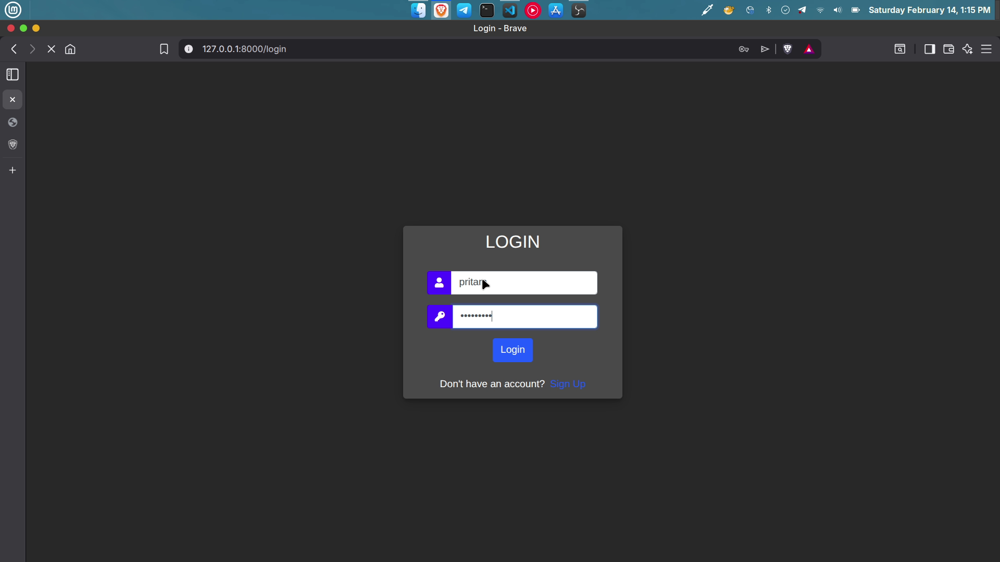

### Dashboard
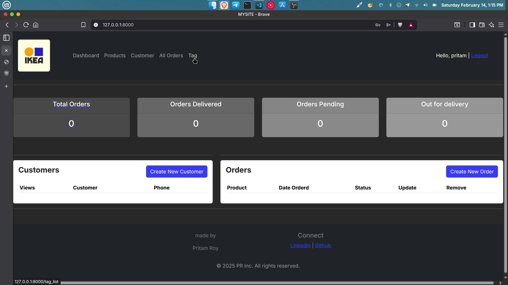

### Products
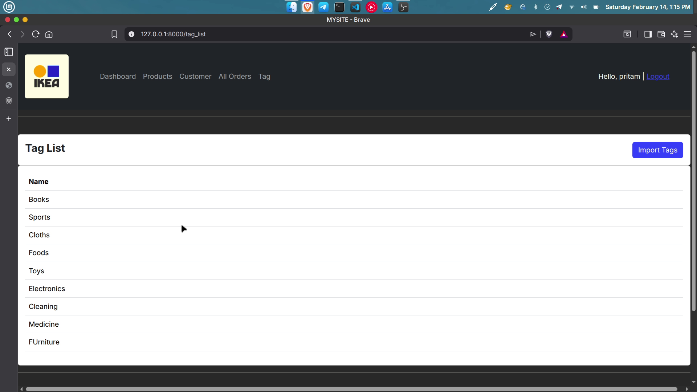
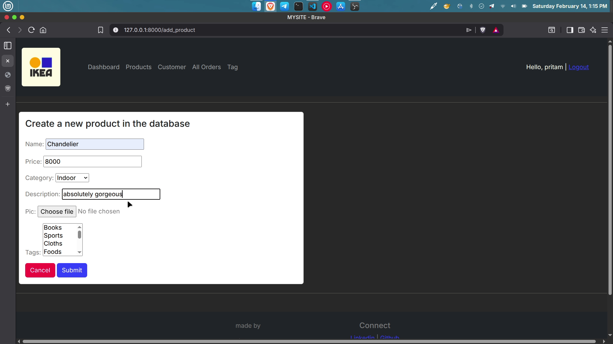
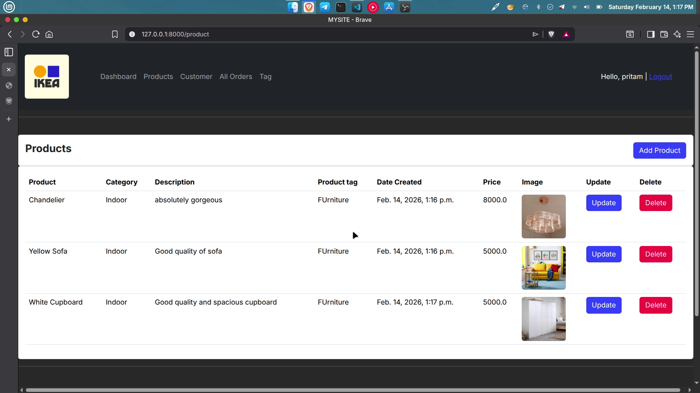

### Customers
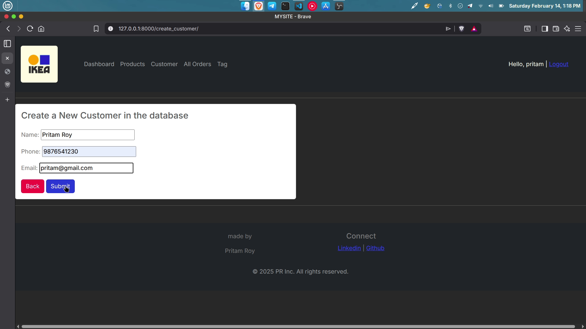
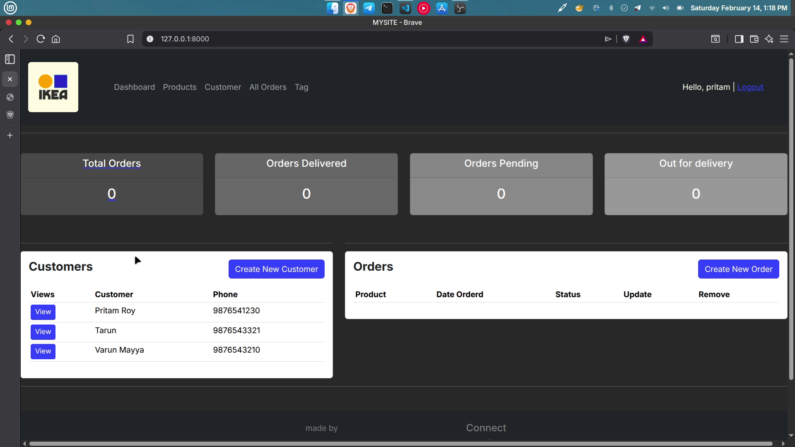

### Creating Orders
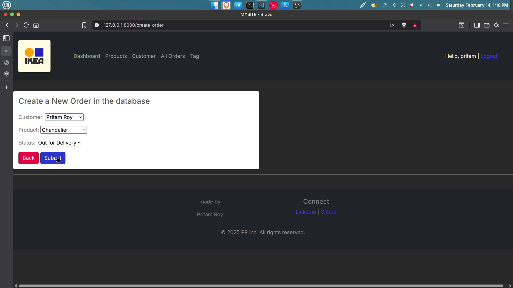

### Updated Dashboard
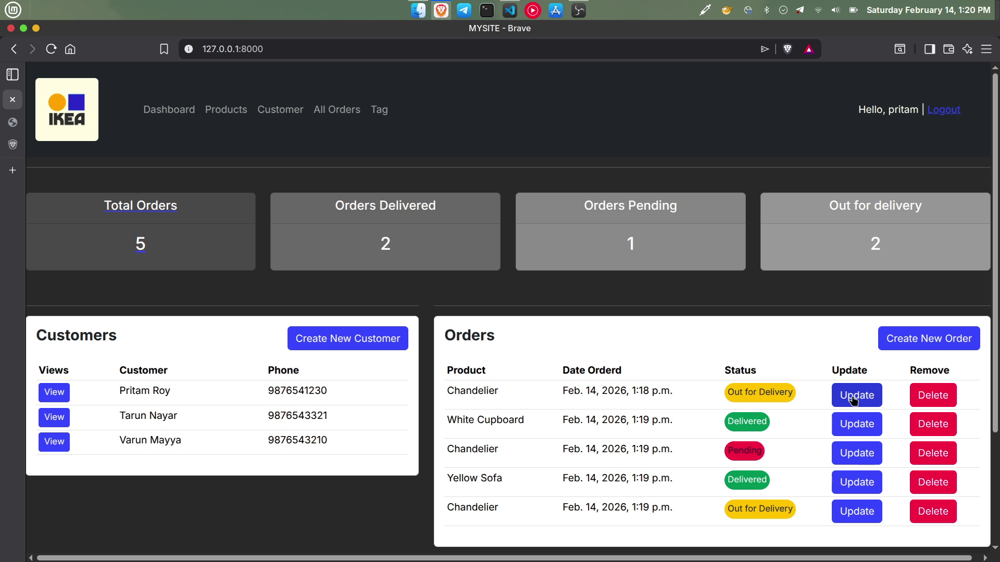

### Updating Orders
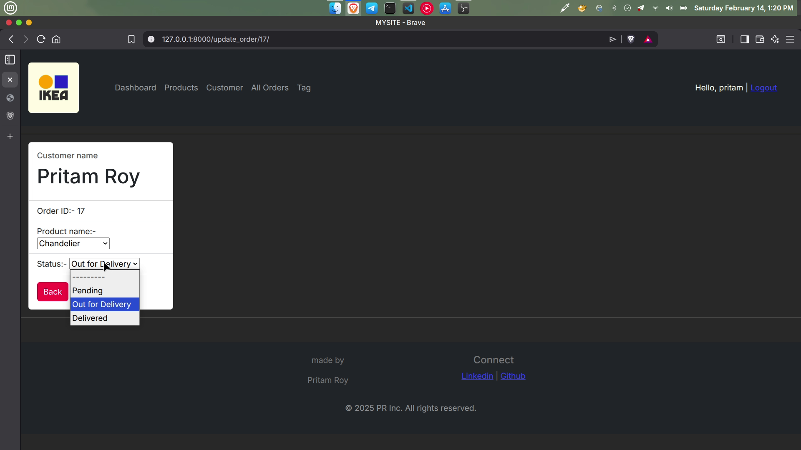
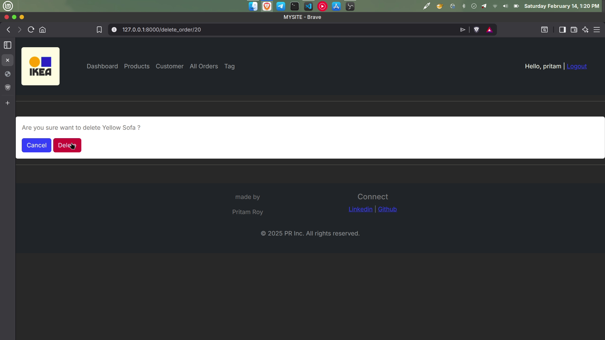

### Updated Dashboard
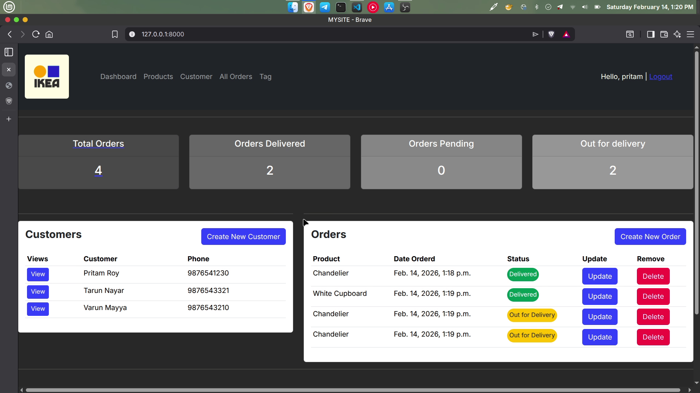

## Setup & Installation

```bash
# Clone the repository
git clone https://github.com/pritamroydev/store-inventory-management.git
cd store-inventory-management

# Create and activate a virtual environment
python -m venv venv
source venv/bin/activate  # On Windows: venv\Scripts\activate

# Install dependencies
pip install -r requirements.txt

# Apply migrations
python manage.py migrate

# Run the development server
python manage.py runserver
```

Then head to `http://127.0.0.1:8000/` to try it out.

## Project Status

Still local and still undeployed, and that's fine. This one was about getting Django's ORM, forms, and templating right, not about putting up a live site.

## Author

**Pritam Roy**
[Portfolio](https://pritamroy.in) · [GitHub](https://github.com/pritamroydev) · [LinkedIn](https://www.linkedin.com/in/myselfpritamroy/)
